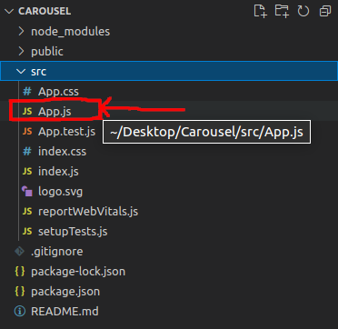
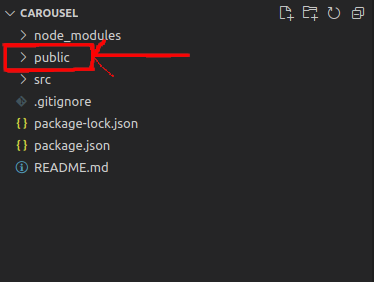
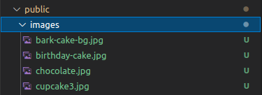

# How to Create a Carousel in React JS
In this article we'll follow some simple steps in order to realize a simple image carousel in React using ``` create-react-app ```. This article assumes the reader has little or basic knowledge working with react and equally react hooks. The first thing to note is that we'll be building this carousel app using a functional component while utilizing react hooks for state management. In addition to the above we'll also build our own custom hook from scratch. If you're someone like me you probably want to kick into the real action already, so let's do that right away. 

1. #### Create our Carousel App
    Start by creating the __Carousel app__ using ``` create-react-app ```. If you have no knowledge about doing this you can visit their documentation at <a href="#">Create react app link here</a>. They have a detailed explaination far better than anything I can give you.

    At the end you should have a folder that contains our app and it's modules. All our code will be written in the ___App.js___ file found in the src folder

    

    Edit the __App.js__ file to look something like the code below

    ```r 
        import React from "react"

        export default function Carousel() {
            return (
                <div>This is our carousel container</div>
            )
        }
    ```
2. #### Add our images to the app
    Webpack has some build issues dealing with internal images. The best and easiest work around this issues is to store our images in the public folder(where our index.html is found), this will make webpack include our images during the build process.

    

    We'll create an images folder inside the public folder to hold all our carousel images. Well you could decide to put them directly in the public directory that won't cause any problems but to follow certain convention I advice you put them in the images folder.

    

3.  Let's create an array to hold all the images path found in the public folder and a variable called _currentImg_ which will point to the current image being rendered. Create a img tag with it's ```src ``` the value of currentImg.   

    ```js
    export default function Carousel() {
        const gallery = ['/images/bark-cake-bg.jpg','/images/birthday-cake.jpg','/imageschocolate.jpg/','/images/cupcakes3.jpg']
        const currentImg = gallery[0]
            return (
                <div>
                    
                </div>
            )
    }
    
    ```
    We're doing this because we want to loop/iterate over the gallery array and select different image path to be rendered using this array indexes. 
    <br>
    Right now the image that is display depends on the value of _currentImg_, which is hard coded to __gallery[0]__. We need a way to change it's value rather than it being static like above.
    <br>
    The best way to do that is introducing state. Since we are using a functionaly react component, the only way to add state to it is by using react hooks. 
    ```js 
        import React, {useState, useEffect} from "react"

        export default function Carousel() {
            const [count, setCount] = useState(0)
            const gallery = ['/images/bark-cake-bg.jpg','/images/birthday-cake.jpg','/imageschocolate.jpg/','/images/cupcakes3.jpg']
            const currentImg = count
            return (
                <div>
                    
                </div>
            )
    }

    ```

4. Now we have to find a way to change the count state so that the url of the image being rendered changes. So to do this we'll create a custom hook called __useInterval__, that sets an interval, and clears that interval when it's unmounted.    

```js 

    const callback = () => {
        //Can read new state and props
        setCount(count + 1)
        //when count is already greater than our array size go back to the first index.
        if (previousCount > gallery.length - 2)
        setCount(0)
    }

    function useInterval(callback) {
        useEffect(() =>
            {
                let timer = setInterval(callback, 1000)
                return () => clearInterval(timer)
            }
        )
    }

    useInterval(callback)

```

After running this you will notice that interval isn't cleared as desired, this is because the clearInterval and the setInterval have a mismatch. In a not shell the setInterval kind of runs twice, while clearInterval cleans up only one interval. This keeps on repeating as the intervals change. 

### How Can We Solve this ??
The best way to solve the issue is to create a react ref that will point to an interval and it's that referenced interval that will be cleared. 

```js 
    function useInterval(callback) {
        //create my reference object
        const savedCallback = useRef()

        useEffect(() => {
            //after every render save the newest callback our reference object
            savedCallback.current = callback
        })
```

### Why useEffect?? 
We do this because we want to address the newest interval. 


### What Next??
Now all that's let to do is to use the new interval above in our setInterval. And when the interval runs out clear it. 

```js 
    function useInterval(callback) {
        //create my reference object
        const savedCallback = useRef()

        useEffect(() => {
            //after every render save the newest callback our reference object
            savedCallback.current = callback
        })

        function tick() {
            //call the latest timer 
            savedCallback.current();
        }

        let timer = setInterval(tick)
        return () => clearInterval(timer)
    }
```

### What If We Want to be able to Pause/Play our interval?? 
To realise this we'll need to make our useInterval a little bit more dynamic. We'll initialize a new state called __running__ that will tell our hook if to run the interval or not. 

```js
    const [isRunning, setIsRunning] = useState(true)

    function useInterval(callback, delay) {
        //create my reference object
        const savedCallback = useRef()

        useEffect(() => {
        //after every render save the newest callback our reference object
        savedCallback.current = callback
        })

        useEffect(() => {
            function tick() {
                //call the latest timer 
                savedCallback.current();
            }

            /*Using delay instead of isRunning because useEffect won't trigger a re-render when a boolean changes
            Whereas delay here is a parameter which isn't a boolean, and changes depending on isRunning state. 
            */
            if (delay !== null) {
                let timer = setInterval(tick, delay)
                return () => clearInterval(timer)
            }
        }, [delay])
    }

    useInterval(callback, isRunning ? 5000 : null)
```

So now if we want to play/pause the interval all we have to do is mutate the is running state.